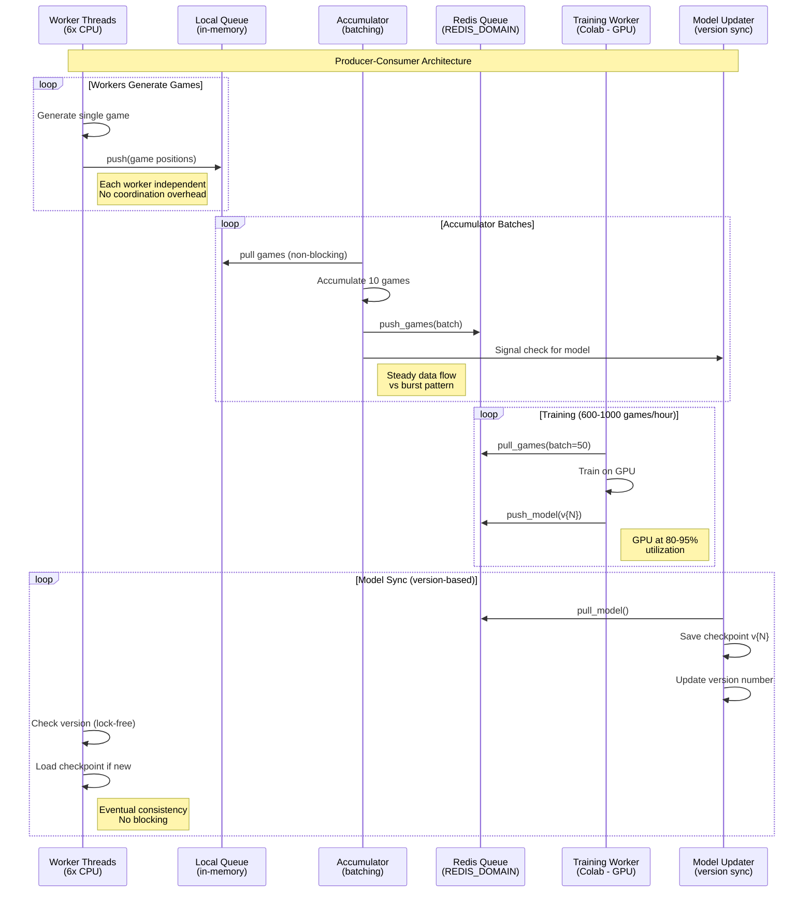

# AlphaGomoku: AlphaZero-style Gomoku AI

A strong Gomoku (15×15) AI implementation using AlphaZero methodology with self-play training, Monte Carlo Tree Search (MCTS), and deep neural networks. **Now with evaluation framework and optimized training!** 🚀

## 🎯 Project Overview

- **Goal**: Build a competitive Gomoku AI that can beat experienced human players
- **Architecture**: DW-ResNet-SE + MCTS + Threat-Space Search + Endgame Solver
- **Training**: Optimized for fast iteration with evaluation tracking
- **UI**: Modern Vue 3 web application with FastAPI backend
- **Deployment**: Docker + Docker Compose for easy setup
- **Board Size**: 15×15 (classic Gomoku rules)

## 🎮 Play Against Your AI

**Quick Start**:
```bash
docker-compose up --build
```

Then open http://localhost:5173 in your browser!

See [docs/QUICKSTART.md](docs/QUICKSTART.md) for detailed instructions.

## 🚀 Quick Start (Training)

### Prerequisites

- Python 3.8+
- PyTorch with MPS (Apple Silicon) or CUDA (NVIDIA GPU)
- 8GB+ RAM (16GB+ recommended)
- 20GB+ disk space

### Installation

```bash
# 1. Clone repository
git clone <repository-url>
cd alphagomoku

# 2. Create environment
conda create -n alphagomoku python=3.12
conda activate alphagomoku

# 3. Install dependencies
pip install -r requirements.txt
pip install -e .

# 4. Verify installation
make test
```

### Start Training

**NEW: Get recommendations for YOUR hardware!**
```bash
# See what's optimal for your hardware
make show-hardware-config
```

Or use preset configurations:

```bash
# Recommended: Fast iteration with evaluation
make train-fast

# Or: Balanced training (default)
make train

# Or: Maximum strength (slower)
make train-production
```

That's it! Training will:
- Use optimal model size for your hardware
- Evaluate automatically every 5 epochs
- Track Elo ratings
- Save checkpoints
- Resume automatically if interrupted

## 📊 Model Presets

Choose the right model for your needs:

| Preset | Parameters | Training Speed | Strength | Use Case |
|--------|-----------|---------------|----------|----------|
| **small** | 1.2M | ⚡⚡⚡ Fast | 80% | Development, experiments |
| **medium** | 3M | ⚡⚡ Medium | 90% | Production, strong play |
| **large** | 5M | ⚡ Slow | 100% | Research, maximum strength |

**Recommendation**: Start with `small` for fast iteration, then scale to `medium` for production.

## 🏋️ Training Configurations

### Fast Iteration (Recommended for Development)
```bash
make train-fast
```
- Model: small (1.2M params)
- Time: 10-15 min/epoch
- Throughput: 80+ epochs/day
- Best for: Quick experiments, development

### Balanced Training (Recommended Default)
```bash
make train
```
- Model: small (1.2M params)
- Time: 15-25 min/epoch
- Throughput: 50+ epochs/day
- Best for: Achieving strong play quickly

### Production Training (Maximum Strength)
```bash
make train-production
```
- Model: medium (3M params)
- Time: 40-60 min/epoch
- Throughput: 24-36 epochs/day
- Best for: Final strong model

## 📈 Evaluation & Monitoring

Training automatically includes:

1. **Elo Rating Tracking**
   - Tracks model strength over epochs
   - Saved to `checkpoints/elo_history.json`

2. **Tactical Test Suite**
   - Tests win-in-1, defense, double attacks
   - Measures tactical awareness

3. **Win Rate vs Baseline**
   - Compares against fixed MCTS opponent
   - Shows if model is improving

View results:
```bash
# Evaluate latest checkpoint
make evaluate-latest

# Test tactical awareness
make test-tactical-latest

# View Elo history
cat checkpoints/elo_history.json
```

## 🎨 Web UI Features

The project includes a complete web interface:

- **Modern Wood-Themed Board**: SVG-rendered 15×15 Gomoku board
- **Three Difficulty Levels**: Easy, Medium, Hard
- **Real-Time Timers**: Track player and AI time
- **AI Thinking Indicator**: Visual feedback during AI computation
- **Debug Panel**: MCTS statistics, policy heatmap, top moves
- **Game Controls**: New game, resign, difficulty selection

See [docs/UI_IMPLEMENTATION.md](docs/UI_IMPLEMENTATION.md) for details.

## 📁 Project Structure

```
alphagomoku/
├── alphagomoku/          # Core ML package
│   ├── config.py         # ⭐ NEW: Centralized configuration
│   ├── env/              # Gomoku environment
│   ├── model/            # Neural network (with presets!)
│   ├── mcts/             # Monte Carlo Tree Search
│   ├── tss/              # Threat-Space Search
│   ├── endgame/          # Endgame solver
│   ├── selfplay/         # Self-play data generation
│   ├── train/            # Training pipeline (optimized!)
│   ├── eval/             # ⭐ NEW: Evaluation framework
│   └── utils/            # Utilities
├── apps/                 # Web application
│   ├── backend/          # FastAPI server
│   └── frontend/         # Vue 3 UI
├── scripts/              # Training scripts
├── tests/                # Unit, integration tests
├── docs/                 # Documentation
├── Makefile              # ⭐ NEW: Optimized training commands
└── checkpoints/          # Model checkpoints

⭐ = New/significantly updated in refactoring
```

## 🔧 Advanced Usage

### Custom Training Configuration

```bash
# Override specific parameters
python scripts/train.py \
    --model-preset small \
    --mcts-simulations 500 \
    --selfplay-games 150 \
    --epochs 100 \
    --eval-frequency 10
```

### Using Config Presets in Code

```python
from alphagomoku.config import get_training_config, print_config_summary
from alphagomoku.model.network import GomokuNet

# Load preset
config = get_training_config("balanced")
print_config_summary(config)

# Create model
model = GomokuNet.from_preset("small")
print(f"Model: {model.get_model_size():,} params")
```

### Resume Training

```bash
# Automatically resumes from latest checkpoint
make train

# Or specify checkpoint
python scripts/train.py --resume checkpoints/model_epoch_50.pt
```

## 🌐 Distributed Training

**NEW:** Train 4-6x faster by separating self-play (CPU) from training (GPU)!

### Architecture



### Quick Start

**1. Setup Redis**

**2. Start Self-Play Workers (Mac M1 Pro):**
```bash
# Add to .env file:
REDIS_URL=redis://:password@REDIS_DOMAIN:6379/0

# Start unified manager with 6 CPU workers
make distributed-selfplay-cpu-workers
```

**3. Start Training Worker (Colab/Cloud GPU):**
- Open `train_universal.ipynb` in Colab
- Set `TRAINING_MODE = "distributed"`
- Set `REDIS_URL`
- Run all cells

**New Architecture Benefits:**
- ✅ **Producer-consumer pattern**: Workers generate games independently, accumulator batches for Redis
- ✅ **Version-based model sync**: Lock-free updates, no race conditions, eventual consistency
- ✅ **Unified dashboard**: Live statistics from all workers in one place
- ✅ **Efficient batching**: Steady data flow instead of burst pattern
- ✅ **4-6x faster training**: CPU and GPU work in parallel
- ✅ **Cost-effective**: Use free Colab T4 GPU + local Mac CPU ($0-10/month vs $60-120 for dedicated GPU)

See [docs/TRAINING.md#distributed-training](docs/TRAINING.md#distributed-training) for detailed setup.

## 🧪 Testing

```bash
# Run unit tests
make test

# Run all tests (including integration)
make test-all

# Test specific module
pytest tests/unit/test_model.py -v
```

## 📖 Documentation

### Getting Started
- [docs/QUICKSTART.md](docs/QUICKSTART.md) - Installation and first steps (5 minutes)
- [docs/TRAINING.md](docs/TRAINING.md) - **⭐ Complete training guide** (philosophy, GPU/CPU architecture, cloud setup)
- [docs/CLOUD_VM_RECOMMENDATIONS.md](docs/CLOUD_VM_RECOMMENDATIONS.md) - Cloud GPU recommendations and cost analysis

### Features & Architecture
- [docs/TSS.md](docs/TSS.md) - Threat Space Search (when to use, configuration, usage)
- [docs/OPENING_STRATEGY.md](docs/OPENING_STRATEGY.md) - Opening book strategy
- [docs/FORCED_WINS_VERIFIED.md](docs/FORCED_WINS_VERIFIED.md) - Endgame solver verification
- [docs/PROJECT_DESCRIPTION.md](docs/PROJECT_DESCRIPTION.md) - Project architecture overview
- [docs/OPTIMIZATIONS.md](docs/OPTIMIZATIONS.md) - Performance optimizations

### Development
- [docs/DEVELOPMENT.md](docs/DEVELOPMENT.md) - Development setup and workflow
- [docs/TESTING.md](docs/TESTING.md) - Testing guide
- [docs/API.md](docs/API.md) - Backend API documentation
- [docs/MEMORY_REQUIREMENTS.md](docs/MEMORY_REQUIREMENTS.md) - Memory requirements

### Deployment & UI
- [docs/DEPLOYMENT.md](docs/DEPLOYMENT.md) - Deployment guide (Docker, production)
- [docs/UI_IMPLEMENTATION.md](docs/UI_IMPLEMENTATION.md) - Web UI architecture
- [CONTRIBUTING.md](CONTRIBUTING.md) - How to contribute

## 🎓 Key Improvements (2025 Refactoring)

The project was refactored for optimal training performance:

### Before
- Model: 5M params (slow)
- Training: 3-4 hours/epoch
- Total time (200 epochs): 14-16 days
- Evaluation: None ❌
- Configuration: Scattered, hardcoded

### After
- Model: 1.2M params (small preset)
- Training: 15-25 min/epoch
- Total time (200 epochs): 2.5-4 days
- Evaluation: Every 5 epochs ✅
- Configuration: Centralized presets

**Result**: 4-6x faster training with continuous evaluation!

See [WHATS_NEW.md](WHATS_NEW.md) for complete details.

## 🤝 Contributing

Contributions welcome! Please:

1. Follow the existing code style
2. Write tests for new features
3. Update documentation
4. Run `make test` before submitting

See [docs/DEVELOPMENT.md](docs/DEVELOPMENT.md) for development setup.

## 📄 License

MIT License - see LICENSE file for details.

## 🙏 Acknowledgments

- **AlphaZero** paper (Silver et al., 2017) for the core methodology
- **Gomoku** community for game rules and strategies
- **PyTorch** team for the excellent deep learning framework

## 📞 Support & Questions

- **Issues**: Use GitHub issues for bugs and feature requests
- **Discussions**: Use GitHub discussions for questions
- **Documentation**: Check `docs/` folder and `make help`

---

**Ready to train?** Run `make help` for all options, or start with `make train-fast`!
