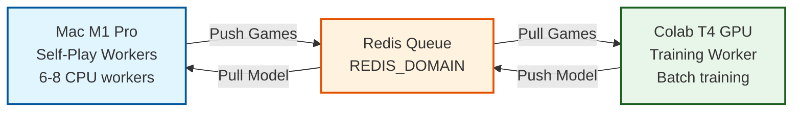
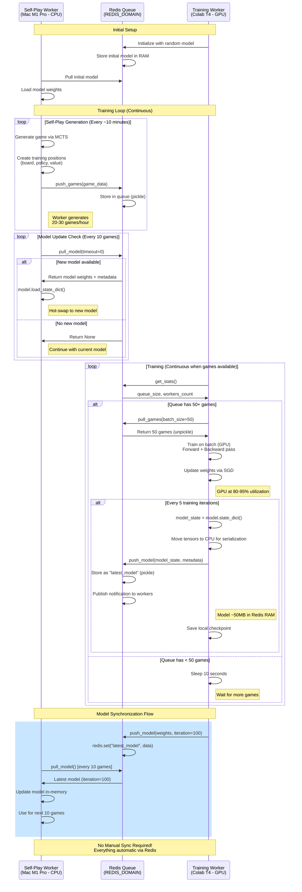

# Distributed Training Architecture

This document provides a detailed explanation of the distributed training architecture for AlphaGomoku.

## Overview

Distributed training separates self-play generation (CPU-bound) from neural network training (GPU-bound), enabling:
- **4-6x faster training** than single-machine setup
- **Efficient resource utilization**: Use local Mac CPU + cloud GPU simultaneously
- **Cost optimization**: $0-10/month using free Colab vs $60-120/month for dedicated GPU
- **Automatic model synchronization**: No manual intervention required

---

## Architecture Diagram



---

## Detailed Sequence Diagram



---

## Component Responsibilities

### 1. Self-Play Workers (Mac M1 Pro - CPU)

**Purpose**: Generate training data via self-play games

**Responsibilities**:
- Run MCTS simulations to generate games
- Create training positions (board state, policy target, value target)
- Push game data to Redis queue
- Pull latest trained models periodically
- Hot-swap models without interrupting generation

**Code Location**: `scripts/distributed_selfplay_worker.py`

**Key Configuration**:
```bash
--mcts-simulations 100      # Simulations per move
--batch-size-mcts 96        # Batch size for neural network inference
--device cpu                # Use CPU for inference
--worker-id mac-cpu-1       # Unique worker identifier
--model-update-frequency 10 # Pull model every 10 games
```

**Performance** (6 CPU workers):
- Per-game time: ~10 minutes
- Total throughput: 120-180 games/hour
- CPU utilization: 60-80%
- RAM usage: 4-6 GB

**Makefile Command**:
```bash
make distributed-selfplay-cpu-workers
```

---

### 2. Redis Queue

**Purpose**: Central coordinator for games and models

**Responsibilities**:
- Store game data in queue (FIFO)
- Store latest trained model in RAM
- Track worker heartbeats
- Provide statistics and monitoring
- Handle pub/sub for model updates

**Key Redis Operations**:
```python
# Game queue
redis.rpush("games:queue", pickle.dumps(game_data))
redis.lpop("games:queue")  # FIFO retrieval

# Model storage
redis.set("latest_model", pickle.dumps(model_state))
redis.get("latest_model")

# Statistics (note: these count positions, not games)
redis.incr("stats:games_pushed")  # Actually counts positions
redis.incr("stats:games_pulled")  # Actually counts positions

# Worker heartbeat
redis.setex(f"worker:{worker_id}", 60, timestamp)
```

**Storage Requirements**:
- Game queue: ~10-50 MB (typical)
- Latest model: ~50 MB
- Total RAM: 500 MB allocated (with LRU eviction)

**Access**:
- Redis URL: `redis://:password@REDIS_DOMAIN:6379/0`
- Redis Commander UI: `http://REDIS_DOMAIN:8081`

---

### 3. Training Worker (Colab T4 - GPU)

**Purpose**: Train neural network on GPU using queued games

**Responsibilities**:
- Pull batches of games from Redis
- Train neural network on GPU
- Publish trained models back to Redis
- Save checkpoints locally
- Monitor queue statistics

**Code Location**: `scripts/distributed_training_worker.py`

**Key Configuration**:
```bash
--model-preset medium                            # 5.04M parameters
--batch-size 1024                                # Training batch size
--device cuda                                    # Use CUDA GPU
--min-position-batches-for-training 50           # Wait for 50+ position batches (~50K positions)
--position-batches-per-training-pull 50          # Pull 50 position batches (~50K positions) per iteration
--publish-frequency 5                            # Publish model every 5 iterations
```

**Performance** (Colab T4):
- Games processed: 600-1000 games/hour
- GPU utilization: 80-95% (vs 25-40% single-machine)
- Training time: ~15-30 seconds per batch of 50 games
- Model publish time: ~2-5 seconds

**Jupyter Notebook**: `train_universal.ipynb`
- Set `TRAINING_MODE = "distributed"`
- Set `REDIS_URL`
- Run all cells

---

## Data Flow

### Game Data Structure

**Format**: Pickle-serialized list of `SelfPlayData` objects

```python
game_data = [
    {
        'board': np.ndarray,      # 15x15 board state
        'policy': np.ndarray,     # 225-dim policy target
        'value': float,           # Value target [-1, 1]
        'current_player': int,    # 1 or -1
    },
    # ... more positions from the same game
]
```

**Size**: ~1-5 KB per position, ~50-200 positions per game = ~50-1000 KB per game

### Model Data Structure

**Format**: Pickle-serialized dictionary

```python
model_data = {
    'model_state': {
        'conv1.weight': torch.Tensor,
        'conv1.bias': torch.Tensor,
        # ... all model parameters
    },
    'metadata': {
        'iteration': int,
        'total_positions': int,
        'metrics': {
            'loss': float,
            'policy_accuracy': float,
            'value_mae': float,
            'lr': float,
        }
    }
}
```

**Size**: ~50 MB (for medium model, 5.04M params)

---

## Performance Comparison

### Single-Machine Training (Baseline)

```
Mac M1 Pro (MPS):
├─ Self-play: 90% of time (CPU-bound MCTS)
├─ NN Training: 10% of time (GPU-bound)
├─ GPU utilization: 25-40% average
└─ Total time: ~2 hours/epoch (5M model, 128 games)
```

### Distributed Training

```
Mac M1 Pro (6 CPU workers):
├─ Self-play: Continuous (parallelized)
├─ Games generated: 120-180 games/hour
└─ CPU utilization: 60-80%

Colab T4 GPU:
├─ NN Training: Continuous (when games available)
├─ Games processed: 600-1000 games/hour
├─ GPU utilization: 80-95%
└─ Training: ~1.5 hours for 200 games

Speedup: 4-6x faster than single-machine
```

---

## Model Synchronization

### How It Works

1. **Training worker trains and publishes** (every 5 iterations):
   ```python
   model_state = model.state_dict()
   model_state = {k: v.cpu() for k, v in model_state.items()}
   queue.push_model(model_state, metadata)
   ```

2. **Redis stores in RAM**:
   ```python
   redis.set("latest_model", pickle.dumps(model_data))
   redis.publish("model_updates", json.dumps(metadata))
   ```

3. **Self-play workers pull periodically** (every 10 games):
   ```python
   model_data = queue.pull_model(timeout=0)
   if model_data:
       model.load_state_dict(model_data['model_state'])
   ```

### Key Properties

- **Asynchronous**: Workers don't wait for training to complete
- **Policy lag**: Workers may use slightly stale models (acceptable in AlphaZero)
- **Hot-swap**: Model updated in-memory without restarting worker
- **No disk I/O**: Model only in Redis RAM (fast access)
- **Automatic**: No manual intervention required

---

## Monitoring

### Queue Statistics

```bash
# Real-time monitoring
make distributed-monitor

# Or directly:
python scripts/monitor_queue.py --redis-url $REDIS_URL
```

**Output**:
```
╔══════════════════════════════════════════════════════════╗
║               AlphaGomoku Queue Monitor                  ║
╚══════════════════════════════════════════════════════════╝

Queue Status:
  Games in queue: 47 batches
  Games pushed:   2,450 total
  Games pulled:   2,403 total
  Latest model:   iteration 120

Active Workers:
  Self-play workers:  6 active (last seen <10s ago)
  Training workers:   1 active (last seen <5s ago)

Performance:
  Self-play rate:    ~160 games/hour
  Training rate:     ~720 games/hour
  Queue healthy:     ✓ (training faster than generation)
```

### Redis Commander (Web UI)

Access at `http://REDIS_DOMAIN:8081`

Features:
- Browse Redis keys
- View queue contents
- Monitor memory usage
- Real-time statistics

---

## Cost Analysis

### Hardware Costs

| Component | Hardware               | Cost | Total/Month |
|-----------|------------------------|------|-------------|
| **Self-Play** | Mac M1 Pro (owned)     | $0/hr | $0 |
| **Queue** | 2GB RAM VM (Remote VM) | $5/mo | $5 |
| **Training** | Colab T4 (free tier)   | $0/hr | $0 |
| **Training (Pro)** | Colab A100             | $10/mo | $10 |

**Total**: $0-10/month (free tier or Pro)

### Comparison to Dedicated GPU

| Setup | Cost | Training Time (200 epochs) |
|-------|------|---------------------------|
| **Distributed (Colab T4)** | $0-5/mo | ~2-3 weeks |
| **Distributed (Colab A100)** | $10/mo | ~1-2 weeks |
| **Cloud RTX 4090** | $0.70/hr × 24 × 30 = $504/mo | ~5-7 days |
| **Cloud A100** | $1.50/hr × 24 × 30 = $1,080/mo | ~3-4 days |

**Savings**: 50-100x cheaper with distributed training (using free Colab)

---

## Troubleshooting

### Common Issues

**1. "Connection refused" to Redis**
```bash
# Check Redis is running
redis-cli -u $REDIS_URL ping
# Expected output: PONG

# Check firewall allows port 6379
telnet REDIS_DOMAIN 6379
```

**2. Training worker idle (no games)**
```bash
# Check queue status
python scripts/monitor_queue.py --redis-url $REDIS_URL

# Expected: 10+ games in queue
# If queue is empty, check self-play workers are running
```

**3. Self-play workers not updating model**
```bash
# Check model is published
redis-cli -u $REDIS_URL get latest_model | wc -c
# Expected: ~50 million bytes

# Workers pull every 10 games (by design)
# Check logs: "Updated to model from iteration X"
```

**4. GPU utilization low in distributed mode**
```bash
# Should be 80-95% during training batches
# If low, increase batch size or min-position-batches-for-training

# Edit CONFIG in train_universal.ipynb:
batch_size = 2048  # increase
min_position_batches_for_training = 100  # increase
```

---

## Security Considerations

### Data Privacy

- Game data contains no personal information
- Model weights are non-sensitive
- Redis queue can be publicly accessible (with password)

---

## Scaling

### Adding More Self-Play Workers

```bash
# On additional machines (Mac, Linux, Windows)
export REDIS_URL="redis://:password@REDIS_DOMAIN:6379/0"

# Start workers with unique IDs
python scripts/distributed_selfplay_worker.py \
    --redis-url "$REDIS_URL" \
    --worker-id machine2-cpu-1 \
    --device cpu
```

### Multiple Training Workers

**Not recommended**: Multiple training workers can conflict

**Alternative**: Use multiple GPUs in single training worker (future work)

### Queue Scaling

Current setup handles:
- 10-20 self-play workers
- 1 training worker
- 1000+ games/hour throughput

For larger scale:
- Use Redis Cluster (multi-node)
- Implement proper distributed locking
- Add load balancing

---

## Future Improvements

1. **Multi-GPU training**: Support multiple GPUs in single training worker
2. **Better policy lag handling**: Implement model versioning and staleness tracking
3. **Persistent queue**: Move from Redis RAM to disk-backed queue for reliability
4. **Monitoring dashboard**: Web-based real-time monitoring
5. **Auto-scaling**: Dynamically adjust worker count based on queue size
6. **Model compression**: Use smaller model serialization formats (ONNX, quantization)

---

## References

- [AlphaZero paper](https://arxiv.org/abs/1712.01815) - Original distributed training architecture
- [docs/TRAINING.md](TRAINING.md) - Complete training guide
- [train_universal.ipynb](../train_universal.ipynb) - Jupyter notebook for training worker
