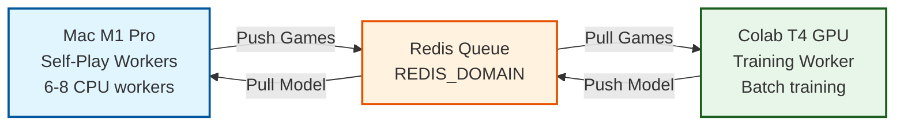
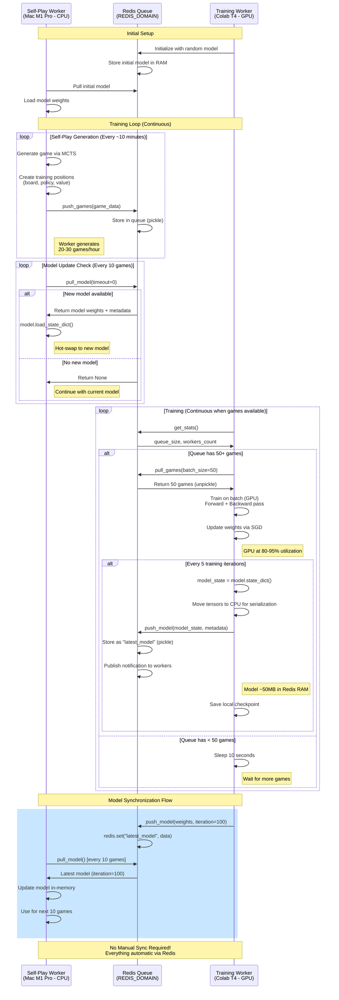

# Training Guide: AlphaGomoku

Complete guide to training strong Gomoku AI models using AlphaZero-style reinforcement learning.

---

## Table of Contents

1. [Overview](#overview)
2. [Training Philosophy](#training-philosophy)
3. [Architecture](#architecture)
4. [Training Pipeline](#training-pipeline)
   - [Phase 3: Data Augmentation](#phase-3-data-augmentation-automatic)
5. [Performance Expectations](#performance-expectations)
6. [Troubleshooting](#troubleshooting)
7. [Cloud Training](#cloud-training)
8. [Distributed Training](#distributed-training)

**Additional Documentation:**
- [Symmetry Augmentation Details](SYMMETRY_AUGMENTATION.md) - Complete guide to 8-fold symmetry augmentation

---

## Overview

This project uses AlphaZero-style training: neural networks learn through pure self-play combined with Monte Carlo Tree Search (MCTS). The key insight is to **train with pure MCTS** (fast, GPU-accelerated) and **infer with TSS enhancements** (strong tactical play).

### Quick Start

```bash
# Fast training (for testing)
make train-fast

# Balanced training (recommended for local)
make train

# Production training (for cloud/strong models)
make train-production
```

### Key Principles

- **Train pure, infer enhanced**: Use `difficulty=easy` (pure MCTS) for training, `difficulty=medium` (TSS enabled) for playing
- **GPU for neural networks, CPU for tree search**: This is architectural, not a limitation
- **AlphaZero methodology**: No domain heuristics during training - the network learns everything through self-play

---

## Training Philosophy

### Why Train with `difficulty=easy`?

**TL;DR:** Train with pure MCTS (4-6x faster), use TSS during inference/evaluation.

#### Two Independent Settings

| Setting | What It Controls | Options |
|---------|------------------|---------|
| **`--model-preset`** | Neural network size | `small` (1.2M), `medium` (3M), `large` (5M) |
| **`--difficulty`** | Search augmentation | `easy` (MCTS only), `medium` (MCTS+TSS+Endgame) |

**They are completely independent!**

#### Recommended Configurations

**For Training:**
```bash
--model-preset medium --difficulty easy
```
- Full model size (3M parameters)
- Pure MCTS (neural network uses GPU, tree traversal on CPU)
- Network learns threats through self-play
- Follows AlphaZero methodology
- Faster training (~30-40 min/epoch on T4 with 1 worker)

**For Inference/Playing:**
```bash
--model-preset medium --difficulty medium
```
- Full trained model
- TSS (Threat Space Search) enabled
- Endgame solver enabled
- Stronger tactical play
- Slower move generation (TSS runs on CPU)

### AlphaZero Principle

AlphaGo/AlphaZero **never used domain-specific heuristics** during training:
- No opening books
- No endgame tables
- No threat detection algorithms
- **Only: Neural Network + MCTS + Self-Play**

The network learned everything through pure self-play.

### Speed Comparison

| Difficulty | Components | Self-Play Time/Game | NN Training GPU Util | Overall Speed |
|------------|-----------|---------------------|----------------------|---------------|
| **easy** | MCTS only | 1-2 min | 95-99% | 4-6x Faster |
| **medium** | MCTS+TSS+Endgame | 6-10 min | 95-99% | Baseline |

**Note**: Self-play is CPU-bound (MCTS tree traversal), showing 10-30% GPU utilization during that phase. Neural network training is GPU-bound (95-99% utilization). TSS adds significant CPU overhead during self-play.

### Learning Quality

**With TSS during training:**
- Network doesn't learn to recognize threats
- Network relies on TSS crutch
- Brittle: TSS might not cover all patterns

**Without TSS (pure self-play):**
- Network learns threat patterns naturally
- More robust and generalizable
- Discovers novel tactics TSS might miss

### When to Use TSS

#### NOT During Training
Training is about teaching the neural network:
```python
# Training (self-play)
model = GomokuNet.from_preset('medium')
selfplay = SelfPlayWorker(model, difficulty='easy')  # Pure MCTS
data = selfplay.generate_batch(100)
trainer.train_epoch(data)
```

#### YES During Inference
Inference is about playing strong moves:
```python
# Playing/Evaluation
model = GomokuNet.from_preset('medium')
model.load_state_dict(torch.load('trained_model.pt'))
search = UnifiedSearch(model, env, difficulty='medium')  # TSS enabled
move = search.get_best_move(state)
```

#### YES During Evaluation
Evaluate with TSS to see true strength:
```python
# Evaluation
evaluator = Evaluator(model, difficulty='medium')  # TSS enabled
elo = evaluator.calculate_elo()
```

### Training Preset Comparison

| Preset | Model | Difficulty | Time/Epoch | Use Case |
|--------|-------|------------|------------|----------|
| **train-fast** | small (1.2M) | easy | 5-10 min (CUDA) | Quick validation, hyperparameter tuning |
| **train** | small (1.2M) | easy | 10-20 min (MPS), 5-10 (CUDA) | Default training, good balance |
| **train-production** | medium (3M) | easy | 20-30 min (CUDA) | Final strong model |

**All use `difficulty: easy` for training!**

### Common Misconceptions

- **"Medium difficulty = Stronger model"** - FALSE! Difficulty only adds TSS/endgame during search, doesn't change model.
- **"I need TSS during training for strong play"** - FALSE! Network learns threats through self-play. TSS is for inference.
- **"Easy difficulty = Smaller model"** - FALSE! Difficulty and model size are independent settings.
- **"Train with easy, infer with medium"** - TRUE! This is the recommended approach.

---

## Architecture

### GPU vs CPU: Understanding the Training Pipeline

**Key Point**: Training has two distinct phases with different hardware usage patterns.

| Phase | Duration | GPU Util | CPU Util | What's Happening |
|-------|----------|----------|----------|------------------|
| **Self-Play** | ~90% of epoch time | 10-30% | 80-95% | MCTS tree search (CPU-bound) |
| **NN Training** | ~10% of epoch time | 95-99% | 5-10% | Backprop through CNN (GPU-bound) |
| **Average** | 100% | ~25-40% | ~75% | Mixed workload |

**This is normal and expected!** MCTS is inherently CPU-bound.

### Why MCTS is CPU-Bound

**MCTS Tree Traversal** (happens on CPU):
```python
def select_leaf(node):
    """Sequential decision making - can't parallelize"""
    while not node.is_leaf():
        # Must wait for each decision before making next one
        node = best_child_by_ucb(node)  # Pointer chasing, if-then logic
    return node
```

**GPU is designed for**:
- Thousands of independent parallel operations
- Matrix multiplications
- Convolutions across spatial dimensions

**GPU is NOT good for**:
- Sequential decisions (must wait for each result)
- Tree traversal (pointer chasing)
- Dynamic branching (if-then-else chains)

### MCTS Time Breakdown

For a single move with 100 simulations (total: 1000ms):

```
CPU Operations (99%): 990ms
  - Node selection (UCB calculation): 300ms
  - Legal move checking: 200ms
  - Tree expansion: 150ms
  - Value backpropagation: 300ms
  - Other Python overhead: 40ms

GPU Operations (1%): 10ms
  - Batched neural network inference: 10ms
```

**This 99/1 split is architectural, not a bug!**

### Why CUDA is Faster (Even Though Self-Play is CPU-Bound)

1. **Better CPU Performance**: Cloud Xeon/EPYC (3.0-3.5 GHz) vs Apple M1/M2 (2.4-3.2 GHz) - MCTS is single-threaded, so faster CPU clock = faster MCTS

2. **The .cpu() Fix (CUDA-specific)**:
   - Before fix: Forced GPU→CPU transfer after every batch (327ms/batch)
   - After fix: Keep on device, only transfer when needed (10-50ms/batch)
   - Impact: 6-30x faster batch processing on CUDA
   - MPS impact: Minimal (unified memory, no real data transfer)

3. **Better Multi-Core Scaling**: CUDA systems can run 4+ parallel workers efficiently; MPS systems limited by unified memory contention (~2 workers max)

4. **Faster NN Training**: CUDA has mature cuDNN kernels (15+ years of optimization) vs MPS newer backend (2-3 years)

### Overall Speedup: CUDA vs MPS

| Configuration | Epoch Time | Speedup vs MPS |
|---------------|-----------|----------------|
| MPS, 1 worker | 12.5 hours | 1x (baseline) |
| CUDA T4, 1 worker | 3.5 hours | **3.5x faster** |
| CUDA T4, 4 workers | 55 min | **13x faster** |
| CUDA RTX 4090, 4 workers | 35 min | **21x faster** |

### Monitoring GPU Usage

Expected `nvidia-smi` output:

```bash
watch -n 1 nvidia-smi

# During self-play phase (90% of time):
GPU-Util: 10-30%
Memory-Usage: 2-4 GB / 16 GB

# During NN training phase (10% of time):
GPU-Util: 95-99%
Memory-Usage: 6-8 GB / 16 GB

# Average over full epoch:
GPU-Util: 25-40%
```

**If GPU shows 0% during training phase**, check:
1. Is training phase actually running? (look for "Training" in logs)
2. Is batch size too small? Try `--batch-size 1024`
3. Is model on GPU? Check logs for "Trainer device: cuda"
4. Is CUDA working? Run: `python -c "import torch; print(torch.cuda.is_available())"`

---

## Training Pipeline

### Complete Epoch Breakdown

**Time Distribution (200 games per epoch)**:

| Phase | MPS (M1 Max) | CUDA (T4) | GPU Util | What's Happening |
|-------|--------------|-----------|----------|------------------|
| **Self-play** | 3h 40m | 30-40 min | 5-20% | MCTS tree search (CPU-bound) |
| **Training** | 10-20 min | 3-5 min | 95-99% | Neural net training (GPU-bound) |
| **Total** | ~4 hours | ~35-45 min | ~25% avg | Combined workload |

### Phase 1: Self-Play (90% of epoch time)

**Purpose**: Generate training data (states, policies, outcomes)

**Process** (per game):
```
For 220 moves:
  1. MCTS tree traversal (CPU) ← 990ms per move
  2. Batched NN inference (GPU) ← 10ms per move

Total per game: 220 moves × 1s = 220s = 3.7 minutes
```

**Hardware Usage**:
- CPU: 99% utilized (tree operations)
- GPU: 1% utilized (neural network inference)
- **Overall GPU shows 10-30% because of periodic batch inference**

### Phase 2: Neural Network Training (10% of epoch time)

**Purpose**: Train neural network on collected data

**Process** (per batch of 512 positions):
```
1. Load batch from buffer (CPU) ← 5ms
2. Forward pass (GPU) ← 40ms
3. Calculate loss (GPU) ← 10ms
4. Backward pass (GPU) ← 40ms
5. Update weights (GPU) ← 10ms

Total: ~105ms per batch, 100ms is GPU
```

**Hardware Usage**:
- CPU: 5% utilized (data loading only)
- GPU: 95% utilized (all the heavy lifting)

### Complete Epoch Timeline

**200 games of self-play + neural network training**:

```
MPS (Apple Silicon M1 Max, 1 worker):
  Self-play:  200 games × 3.7min = 740min = 12.3 hours
  NN training: ~15 minutes
  Total: ~12.5 hours per epoch

CUDA (T4, 1 worker):
  Self-play:  200 games × 1min = 200min = 3.3 hours
  NN training: ~5 minutes
  Total: ~3.5 hours per epoch

CUDA (T4, 4 workers parallel):
  Self-play:  50 games × 1min = 50min = 0.83 hours (4 parallel workers)
  NN training: ~5 minutes (same, not parallelized)
  Total: ~55 minutes per epoch
```

### AlphaZero's Approach

**How DeepMind handled the CPU bottleneck**:

1. **C++ MCTS** (100x faster than Python) - Native code, no Python interpreter overhead, still CPU-bound but much faster
2. **Massive parallelism** (100+ workers) - 4 TPUs running self-play, 64 TPUs training neural network, queue-based communication
3. **Custom hardware** (TPUs) - Specialized for neural network training, even faster than GPUs
4. **Still took 40 days** - 4.9 million games, $1M+ in compute costs, even with all optimizations!

**Lesson**: MCTS being CPU-bound is fundamental to the algorithm. Accept it and parallelize.

### Optimization Strategies

#### Easy Wins (Recommended)

1. **Use CUDA instead of MPS** (3-5x speedup)
   - Better CPU for MCTS
   - .cpu() fix works (major impact)
   - Better multi-core scaling

2. **Use multiple workers** (3-4x speedup)
   ```bash
   --parallel-workers 4
   ```
   - 4 games in parallel during self-play
   - NN training is unchanged (trains on combined data)

3. **Reduce simulations for development** (2x speedup)
   ```bash
   --mcts-simulations 50  # Instead of 100
   ```
   - Good for development/testing
   - Use 100-200 for production training

4. **Use difficulty=easy** (4-6x speedup vs medium)
   ```bash
   --difficulty easy  # Pure MCTS, no TSS
   ```
   - Already recommended for training
   - TSS adds huge CPU overhead

#### Advanced Optimizations (Complex, Diminishing Returns)

5. **Numba JIT compilation** (5-10x for hot paths) - Compile UCB calculation to machine code
6. **Cython for MCTS core** (10-50x for tree ops) - Rewrite Node/MCTS classes in Cython
7. **Root batching** (2-3x for inference) - Different MCTS algorithm, trades accuracy for speed

#### Not Worth It

8. **GPU-accelerated legal move generation** - Kernel launch overhead cancels gains
9. **Moving tree traversal to GPU** - Fundamentally incompatible with GPU architecture

### Phase 3: Data Augmentation (Automatic)

**Purpose**: Multiply training data through board symmetries

AlphaGomoku automatically applies **8-fold symmetry augmentation** during training to improve generalization without increasing storage requirements. This is a key technique used by AlphaGo/AlphaZero.

#### How It Works

Every Gomoku board has 8 symmetries (dihedral group D4):
- 1 identity (no change)
- 3 rotations (90°, 180°, 270° clockwise)
- 4 reflections (vertical, horizontal, main diagonal, anti-diagonal)

**During training**, each position is randomly augmented:
```python
# When sampling a training batch
for position in batch:
    sym_id = random.choice(0-7)  # Pick random symmetry
    state_aug = apply_symmetry(state, sym_id)
    policy_aug = apply_symmetry(policy, sym_id)
    # Train on augmented position
```

**During self-play**, positions are stored in **original orientation only** (no augmentation). This is critical - MCTS must operate on consistent board state.

#### Benefits

- **8× effective training data** without storing 8 copies
- **Faster convergence** - network learns rotation-invariant features
- **Better generalization** - reduces overfitting to specific orientations
- **Memory efficient** - lazy augmentation applies symmetry on-demand

#### Implementation

Symmetry augmentation is **enabled by default** in `DataBuffer`:
```python
# Automatic in training pipeline
data_buffer = DataBuffer(db_path, lazy_augmentation=True)  # Default
```

The system ensures **consistency** - when augmenting a position, the state tensor, policy target, and last_move coordinates are all transformed with the same symmetry.

See [SYMMETRY_AUGMENTATION.md](SYMMETRY_AUGMENTATION.md) for detailed documentation.

---

## Performance Expectations

### Training Time Comparison

**Training 1000 epochs (200 games each)**:

| Platform | Self-Play | NN Training | Total | Cost |
|----------|-----------|-------------|-------|------|
| MPS (M1 Max) | 3,670h | 167h | **3,837h (160 days)** | Free (your laptop) |
| CUDA (T4, 1 worker) | 583h | 50h | **633h (26 days)** | ~$220 |
| CUDA (T4, 4 workers) | 146h | 50h | **196h (8 days)** | ~$70 |
| CUDA (RTX 4090, 4 workers) | 100h | 25h | **125h (5 days)** | ~$100 or owned |

### Expected Results by Configuration

**Training on Google Colab T4**:

| Config | Model | Difficulty | Time/Epoch | Time for 200 Epochs | Avg GPU Util |
|--------|-------|------------|------------|---------------------|--------------|
| **Recommended** | medium | easy | ~20-30 min | ~3-5 days | 25-40% (normal) |
| **Not Recommended** | medium | medium | ~2-3 hours | ~20-30 days | 10-20% |

**Note**: 25-40% GPU utilization is **expected and normal** for AlphaZero-style training. Self-play (90% of time) is CPU-bound at 10-30% GPU. NN training (10% of time) is GPU-bound at 95-99%.

**Training on Local M1 Pro**:

| Config | Model | Difficulty | Time/Epoch | Time for 200 Epochs | Avg GPU Util |
|--------|-------|------------|------------|---------------------|--------------|
| **Recommended** | small | easy | ~15-20 min | ~2-3 days | 25-40% (normal) |
| **Not Recommended** | small | medium | ~1-2 hours | ~10-15 days | 10-20% |

### Recommendations by Use Case

#### Development / Prototyping
- **Platform**: MPS (local Mac) or CPU
- **Why**: Free, fast iteration, no cloud costs
- **Settings**: `--model-preset small --mcts-simulations 50 --parallel-workers 1`
- **Speed**: Acceptable for testing (5-10 min per 10 games)

#### Short Training Runs (< 100 epochs)
- **Platform**: CUDA T4 (Google Colab / cloud)
- **Why**: Good price/performance, 3.5x faster than MPS
- **Settings**: `--model-preset medium --mcts-simulations 100 --parallel-workers 1`
- **Cost**: ~$10 for 100 epochs

#### Production Training (1000+ epochs)
- **Platform**: CUDA RTX 4090 or A100 (cloud or owned)
- **Why**: 5-7x faster than T4, best $/epoch
- **Settings**: `--model-preset medium --mcts-simulations 100 --parallel-workers 4`
- **Cost**: ~$50-100 for 1000 epochs

---

## Troubleshooting

### Common Issues and Solutions

#### Issue 1: "MPS not available, using CPU" (on CUDA systems)

**Symptom:**
```
[Worker subprocess] MPS not available, using CPU
```

**Root Cause:** Wrong device detection order (checked for MPS before CUDA)

**Solution:** Fixed in `alphagomoku/selfplay/parallel.py` - now checks CUDA first, then MPS, then CPU

**Verification:**
```bash
python scripts/check_device.py
# Should show: ✅ CUDA is available!
```

#### Issue 2: "Cannot re-initialize CUDA in forked subprocess"

**Symptom:**
```
GPU initialization failed (Cannot re-initialize CUDA in forked subprocess.
To use CUDA with multiprocessing, you must use the 'spawn' start method),
falling back to CPU
```

**Root Cause:** CUDA cannot be initialized in forked subprocesses. Python's default multiprocessing method on Linux/macOS is `fork`, which copies the entire parent process including CUDA state. CUDA drivers detect this and refuse to initialize in forked processes.

**Solution:** Changed multiprocessing to use `spawn` context instead of `fork`:

```python
# OLD (BROKEN with CUDA)
pool = mp.Pool(processes=num_workers, initializer=_worker_initializer)

# NEW (WORKS with CUDA)
ctx = mp.get_context('spawn')  # Fresh processes, no forking
pool = ctx.Pool(processes=num_workers, initializer=_worker_initializer)
```

**Trade-offs:**

| Method | CUDA Support | Startup Speed | Memory | Platform |
|--------|-------------|---------------|---------|----------|
| **fork** | ❌ No | ⚡ Fast | 💾 Shared | Linux/macOS only |
| **spawn** | ✅ Yes | 🐌 Slower | 💾 Separate | All platforms |

**Our choice:** `spawn` because it works with CUDA (essential for Colab/cloud), works on all platforms, and has cleaner process isolation. The slower startup (~1-2 seconds per worker) is an acceptable trade-off.

**Verification:**
```bash
# Start training with parallel workers
python scripts/train.py \
    --model-preset medium \
    --parallel-workers 2 \
    --device auto

# Check for correct messages:
# 🚀 Auto-detected device: CUDA (GPU: Tesla T4)
# [Worker subprocess] Using CUDA device: Tesla T4
# [Worker subprocess] Using CUDA device: Tesla T4
```

#### Issue 3: Low GPU Utilization (~25%)

**Symptom:** GPU shows 25-40% utilization on average

**Root Cause:** This is **expected behavior**, not a bug!

**Explanation:**
- Self-play phase (90% of time): 10-30% GPU (MCTS is CPU-bound)
- NN training phase (10% of time): 95-99% GPU (GPU-bound)
- **Average: 25-40% GPU utilization**

**This is how AlphaZero works!** MCTS tree traversal is inherently CPU-bound.

#### Issue 4: "CUDA out of memory"

**Solution:**
```bash
# Reduce batch sizes
--batch-size 512  # instead of 1024
--batch-size-mcts 96  # instead of 128
```

#### Issue 5: Training Falls Back to CPU

**Verification Steps:**
```bash
# 1. Check if CUDA is available
python -c "import torch; print(torch.cuda.is_available())"

# 2. Check device detection
python scripts/check_device.py

# 3. Check logs for device initialization messages
# Should see: "Using CUDA device: Tesla T4"
# Not: "MPS not available, using CPU"

# 4. If still issues, reinstall PyTorch with CUDA
pip install torch --index-url https://download.pytorch.org/whl/cu118
```

#### Issue 6: Slow Training (Even on CUDA)

**Check:**
```bash
# Monitor GPU usage
watch -n 1 nvidia-smi

# Expected:
# - During self-play: 10-30% GPU (normal, MCTS is CPU-bound)
# - During NN training: 95-99% GPU (should be high)
# - Memory: 4-8 GB VRAM used

# If GPU is 0% during training phase:
# Increase batch size: --batch-size 1024

# If self-play is very slow (>2min/game):
# Check CPU performance, consider using cloud with faster CPU
```

### Device Check Script

Use `scripts/check_device.py` for troubleshooting:

```bash
python scripts/check_device.py
```

**Example output on Colab T4:**
```
✅ CUDA is available!
   Device 0: Tesla T4
      Total memory: 14.75 GB
✅ CUDA works
   CUDA computation works (result shape: torch.Size([100, 100]))
```

---

## Cloud Training

### Quick Recommendations

#### For Strong Player (Best Value) ⭐
**NVIDIA RTX 4090 or A6000**

```
GPU:     RTX 4090 (24GB VRAM) or A6000 (48GB VRAM)
CPU:     8-16 cores
RAM:     32 GB
Storage: 100 GB SSD
Cost:    ~$0.50-0.80/hour
Training: ~3-5 days for 200 epochs (~$50-70 total)
```

#### For Maximum Strength (Premium)
**NVIDIA A100 40GB/80GB**

```
GPU:     A100 40GB or 80GB
CPU:     16-32 cores
RAM:     64 GB
Storage: 200 GB SSD
Cost:    ~$1.50-3.00/hour
Training: ~2-3 days for 200 epochs (~$70-110 total)
```

#### Budget Option (Slower but Works)
**NVIDIA T4 or RTX 3080**

```
GPU:     T4 (16GB) or RTX 3080 (10GB)
CPU:     8 cores
RAM:     32 GB
Storage: 100 GB SSD
Cost:    ~$0.30-0.50/hour
Training: ~5-7 days for 200 epochs (~$50-80 total)
```

### GPU Comparison

| GPU | VRAM | Rel. Speed | $/hour | 200 Epochs | Total Cost | Recommendation |
|-----|------|-----------|--------|------------|------------|----------------|
| **T4** | 16GB | 1.0x | $0.35 | 7 days | ~$60 | Budget |
| **RTX 3080** | 10GB | 1.5x | $0.50 | 5 days | ~$60 | Budget+ |
| **RTX 4090** | 24GB | 3.0x | $0.70 | 3 days | ~$50 | ⭐ **Best Value** |
| **A6000** | 48GB | 2.5x | $0.80 | 3.5 days | ~$67 | Good (more VRAM) |
| **A100 40GB** | 40GB | 4.0x | $1.50 | 2 days | ~$72 | Premium |
| **A100 80GB** | 80GB | 4.0x | $2.50 | 2 days | ~$120 | Overkill |

**Verdict: RTX 4090 is the sweet spot** - 3x faster than T4, best $/performance ratio.

### Recommended Training Configuration (RTX 4090)

```bash
python scripts/train.py \
    --model-preset medium \
    --parallel-workers 1 \
    --batch-size 1024 \
    --batch-size-mcts 128 \
    --selfplay-games 200 \
    --mcts-simulations 400 \
    --difficulty easy \
    --epochs 200 \
    --eval-frequency 10 \
    --device cuda \
    --resume auto
```

**Expected Performance:**
- Time per epoch: ~20-30 minutes (with `difficulty: easy`)
- Total training time: ~3-4 days
- Final Elo: 1800-1900+
- Total cost: ~$50-70

### Cloud Provider Comparison

#### Lambda Labs (Recommended for ML)
**Pros:** ML-optimized, simple pricing, fast setup
**Cons:** Sometimes low availability

**Pricing:**
- RTX 4090: $0.70/hour
- A100 40GB: $1.29/hour

**Website:** https://lambdalabs.com/service/gpu-cloud

#### RunPod (Best for Spot Instances)
**Pros:** Spot pricing (50% cheaper), good availability
**Cons:** Spot instances can be interrupted

**Pricing:**
- RTX 4090: $0.69/hour (on-demand), $0.39/hour (spot)
- A100 40GB: $1.49/hour (on-demand), $0.89/hour (spot)

**Website:** https://www.runpod.io/

#### Vast.ai (Cheapest, Community Marketplace)
**Pros:** Cheapest prices (peer-to-peer), many GPU options
**Cons:** Variable reliability, need to check host quality

**Pricing:**
- RTX 4090: $0.60-0.80/hour
- A100 40GB: $1.00-1.50/hour

**Website:** https://vast.ai/

### Setup Guide for Cloud VM

#### Step 1: Rent the VM
1. Choose provider (Lambda Labs or RunPod recommended)
2. Select RTX 4090 or A100 instance
3. Configure SSH access

#### Step 2: Initial Setup
```bash
# SSH into the instance
ssh ubuntu@<instance-ip>

# Update system
sudo apt update && sudo apt upgrade -y

# Install Python 3.11+
sudo apt install python3.11 python3.11-venv python3-pip git -y

# Clone repository
git clone <your-repo-url>
cd alphagomoku
```

#### Step 3: Install Dependencies
```bash
# Create virtual environment
python3.11 -m venv venv
source venv/bin/activate

# Install PyTorch with CUDA
pip install torch torchvision torchaudio --index-url https://download.pytorch.org/whl/cu118

# Install project
pip install -r requirements.txt
pip install -e .

# Verify GPU
python -c "import torch; print(f'CUDA available: {torch.cuda.is_available()}'); print(f'GPU: {torch.cuda.get_device_name(0)}')"
```

#### Step 4: Start Training
```bash
# Use screen/tmux so you can disconnect
screen -S training
make train-production

# Ctrl+A, D to detach
# screen -r training to reattach

# Or use nohup
nohup make train-production > training.log 2>&1 &
tail -f training.log
```

#### Step 5: Monitor Training
```bash
# Check GPU usage
watch -n 1 nvidia-smi

# Check progress
tail -f training.log

# Download checkpoints regularly
tar -czf checkpoints.tar.gz checkpoints/
scp ubuntu@<instance-ip>:~/alphagomoku/checkpoints.tar.gz .
```

### Cost Optimization Tips

1. **Use Spot/Preemptible Instances** (50-70% savings)
   - Save checkpoints frequently (auto-enabled every epoch)
   - Use `--resume auto` to continue if interrupted

2. **Train Smaller Model First** (30-50% savings on experimentation)
   ```bash
   make train-fast --epochs 10  # Validate pipeline
   make train-production --epochs 200  # Full training
   ```

3. **Use Parallel Workers** (if VM has good CPU)
   ```bash
   --parallel-workers 4  # 4x speedup for self-play
   ```

### Important Considerations

1. **Always Save Checkpoints**: Training auto-saves every epoch to `checkpoints/model_epoch_*.pt` - download regularly!

2. **Monitor Costs**: Set budget alerts on cloud platforms. Expected costs for 200 epochs: T4 (~$60), RTX 4090 (~$70), A100 (~$100)

3. **Use Spot Instances Wisely**: Only if you can handle interruptions. Training auto-resumes from last checkpoint.

4. **Download Results**: Use `scp` or `rsync` to download checkpoints periodically, don't wait until the end.

### Pre-Launch Checklist

Before starting cloud training:

- [ ] Repository pushed to GitHub
- [ ] SSH key configured for instance access
- [ ] Budget set aside (~$100 for safety)
- [ ] Cost alert configured on cloud platform
- [ ] Understand how to use screen/tmux
- [ ] Know how to download results (scp/rsync)

### For More Details

See [docs/CLOUD_VM_RECOMMENDATIONS.md](CLOUD_VM_RECOMMENDATIONS.md) for comprehensive cloud training guide including:
- Detailed provider comparisons
- Training timeline estimates
- Troubleshooting cloud-specific issues
- Cost optimization strategies

---

## Summary

### Key Takeaways

1. **Train pure, infer enhanced**: Use `difficulty=easy` for training (4-6x faster), `difficulty=medium` for playing

2. **GPU utilization is normal**: 25-40% average GPU utilization is expected (90% self-play is CPU-bound, 10% training is GPU-bound)

3. **CUDA is much faster**: 3-21x faster than MPS due to better CPU, .cpu() fix, and parallelization

4. **Use cloud for production**: RTX 4090 is the sweet spot (~$70 for 200 epochs, Elo 1850-1950+)

5. **Architecture is sound**: MCTS being CPU-bound is fundamental to AlphaZero. Accept it and parallelize.

### Quick Reference

| Phase | Model | Difficulty | Use For |
|-------|-------|------------|---------|
| **Training** | small/medium | easy | Fast, GPU-accelerated, AlphaZero style |
| **Evaluation** | small/medium | medium | True strength with TSS enhancements |
| **Inference** | small/medium | medium | Strong tactical play for users |

**Next Steps:**
1. Use `make train-production` for production model
2. It uses `difficulty: easy` automatically
3. When deploying, use `difficulty: medium` for TSS
4. For cloud training, see [CLOUD_VM_RECOMMENDATIONS.md](CLOUD_VM_RECOMMENDATIONS.md)

---

## Distributed Training

Distributed training allows you to separate self-play generation (CPU-bound) from neural network training (GPU-bound), enabling efficient use of multiple machines.

### Architecture Overview



### Detailed Sequence Diagram



**Key Benefits:**
- Use your local Mac for self-play (cheap, always available)
- Use cloud GPU for training (expensive, pay only when training)
- Decouple self-play from training (no GPU idle time during self-play)
- Scale self-play workers independently

### How It Works

1. **Self-Play Workers** (Mac M1 Pro):
   - Run 6-8 CPU workers generating games continuously
   - Push game data to Redis queue
   - Fetch latest trained models every 10 batches
   - Each worker: 20-30 games/hour

2. **Redis Queue**:
   - Stores game data (pickle serialized)
   - Stores trained models (latest 5)
   - Tracks statistics and worker heartbeats
   - Web UI for monitoring (Redis Commander)

3. **Training Worker** (Colab T4):
   - Pulls batches of games from queue
   - Trains neural network on GPU
   - Publishes updated models every 5 batches
   - Can process 600-1000 games/hour

### Setup Instructions

#### Step 1: Setup Redis

#### Step 2: Configure Environment Variables

On both Mac and Colab, set the Redis URL:

```bash
# Mac (add to ~/.zshrc or ~/.bashrc)
export REDIS_URL='redis://:your_secure_password_here@REDIS_DOMAIN:6379/0'

# Colab (in notebook cell)
import os
os.environ['REDIS_URL'] = 'redis://:your_secure_password_here@REDIS_DOMAIN:6379/0'
```

#### Step 3: Start Self-Play Workers on Mac

**Option A: CPU Workers (Recommended)**
```bash
# Start 6 CPU workers in parallel
make distributed-selfplay-cpu-workers
```

**Option B: MPS Worker (Alternative)**
```bash
# Start 1 MPS worker (uses Apple Silicon GPU)
make distributed-selfplay-mps-worker
```

**Manual Start (if Makefile doesn't work):**
```bash
python scripts/distributed_selfplay_worker.py \
    --redis-url "$REDIS_URL" \
    --model-preset small \
    --mcts-simulations 50 \
    --device cpu \
    --worker-id mac-worker-1
```

#### Step 4: Start Training Worker on Colab

**Using Makefile:**
```bash
make distributed-training-gpu
```

**Manual Start:**
```bash
python scripts/distributed_training_worker.py \
    --redis-url "$REDIS_URL" \
    --model-preset medium \
    --batch-size 1024 \
    --device cuda
```

#### Step 5: Monitor Queue Status

```bash
make distributed-monitor
```

This will show:
- Queue size (game batches waiting)
- Active workers (self-play + training)
- Statistics (games pushed/pulled, models published)
- Real-time rates (games/hour)

### Resource Requirements

#### Mac M1 Pro (Self-Play Workers)

| Configuration | Workers | Games/Hour | CPU Usage | Memory |
|---------------|---------|------------|-----------|--------|
| **Recommended** | 6 CPU | 120-180 | 60-80% | 4-6 GB |
| **Alternative** | 1 MPS | 30-40 | 20-30% | 2-3 GB |

**Recommended Setup:**
```bash
# 6 CPU workers (optimal for M1 Pro 6+2 cores)
make distributed-selfplay-cpu-workers

# Settings:
# - Model: small (1.2M params, fast inference)
# - MCTS: 50 simulations (good balance)
# - Device: CPU (better for parallel workers)
# - Batch: 10 games per push
```

#### Colab T4 GPU (Training Worker)

| Configuration | Batch Size | Processing Rate | GPU Util | VRAM |
|---------------|------------|-----------------|----------|------|
| **Optimal** | 1024 | 600-1000 games/hour | 80-95% | 6-8 GB |

**Optimal Settings:**
```bash
# Training worker on T4
make distributed-training-gpu

# Settings:
# - Model: medium (3M params)
# - Batch: 1024 (good GPU utilization)
# - Device: CUDA
# - Publish: every 5 training batches
```

### Performance Calculations

#### Self-Play Generation

**Mac M1 Pro with 6 CPU workers:**
```
Per worker:
  - Game time: 2-3 minutes
  - Games/hour: 20-30

Total (6 workers):
  - Games/hour: 120-180
  - Games/day: 2,880-4,320
  - Positions/day: ~600,000-900,000
```

#### Training Processing

**Colab T4 GPU:**
```
Training batch (50 games, ~10,000 positions):
  - Time: 3-5 minutes
  - Batches/hour: 12-20
  - Games/hour: 600-1000
  - Can keep up with 6-8 self-play workers
```

#### Overall Throughput

| Metric | Mac (Self-Play) | Colab (Training) | Balanced? |
|--------|-----------------|------------------|-----------|
| Games/hour | 120-180 | 600-1000 | ✓ Yes |
| Queue growth | +120-180/hour | -600-1000/hour | ✓ Training faster |
| Cost/day | $0 (local) | ~$2-3 (Colab Pro) | ✓ Affordable |

**Result:** Training worker can process games faster than self-play generates them. Queue will stay small (< 50 batches).

### Cost Analysis

#### Monthly Cost (24/7 Operation)

| Component | Platform | Cost/Hour | Hours/Month | Monthly Cost |
|-----------|----------|-----------|-------------|--------------|
| Self-Play | Mac M1 Pro | $0 | 720 | **$0** |
| Redis Queue | Coolify/Cloud | ~$0.01 | 720 | **$7** |
| Training | Colab Pro | $0.10 | 720 | **$72** |
| **Total** | | | | **$79/month** |

**Cost Optimization:**
- Use Colab free tier: Run 12 hours/day = $0/month training
- Spot instances: ~50% savings on training worker
- Local Redis: Run Redis on Mac = save $7/month

**Realistic Cost (Colab Free + Local Redis):**
- Self-play: $0 (local Mac)
- Redis: $0 (local Docker)
- Training: $0 (Colab free tier, 12 hours/day)
- **Total: $0/month** for hobbyist setup!

### Monitoring and Debugging

#### Using the Monitor

```bash
make distributed-monitor
```

**Monitor shows:**
```
==================================================================
  AlphaGomoku Distributed Training Queue Monitor
==================================================================
  Time: 2025-12-01 10:30:45 | Uptime: 02:15:30

  Connection: ✓ Healthy

──────────────────────────────────────────────────────────────────
  QUEUE STATUS
──────────────────────────────────────────────────────────────────
  Game Batches:     23 ███████████████████████
  Models Available: 5

──────────────────────────────────────────────────────────────────
  ACTIVE WORKERS
──────────────────────────────────────────────────────────────────
  Self-Play Workers: 6
  Training Workers:  1

──────────────────────────────────────────────────────────────────
  STATISTICS
──────────────────────────────────────────────────────────────────
  Games Pushed:  1,234 (180.0/hour)
  Games Pulled:  987 (720.0/hour)
  Models Pushed: 15
  Models Pulled: 90
```

#### Redis Commander UI

Access at `https://REDIS_DOMAIN`:
- View queue contents
- Inspect serialized data
- Monitor memory usage
- Clear queues (if needed)

#### Common Issues

**Issue 1: Queue Growing Too Fast**

**Symptom:** Queue size keeps increasing

**Solutions:**
- Training worker is too slow: increase `--batch-size` or use better GPU
- Too many self-play workers: reduce from 6 to 4
- Training worker crashed: restart it

**Issue 2: No Games in Queue**

**Symptom:** Queue size is 0, training worker waiting

**Solutions:**
- Self-play workers not running: start them
- Self-play workers crashed: check logs
- Redis connection issue: verify `REDIS_URL`

**Issue 3: Workers Not Updating Model**

**Symptom:** Self-play workers using old model

**Solutions:**
- Check `--model-update-frequency` (default: every 10 batches)
- Training worker not publishing: check `--publish-frequency`
- Model too large for Redis: reduce model size

### Advanced Configuration

#### Scaling Self-Play Workers

**Running on multiple Macs:**
```bash
# Mac 1
make distributed-selfplay-cpu-workers  # 6 workers

# Mac 2
python scripts/distributed_selfplay_worker.py \
    --redis-url "$REDIS_URL" \
    --worker-id mac2-worker-1 \
    ...
```

#### Multiple Training Workers

**Using multiple GPUs:**
```bash
# Colab 1 (T4)
make distributed-training-gpu

# Colab 2 (T4)
python scripts/distributed_training_worker.py \
    --redis-url "$REDIS_URL" \
    --checkpoint-dir ./checkpoints_worker2 \
    ...
```

**Note:** Multiple training workers will compete for games. Ensure enough self-play throughput.

### Comparison: Distributed vs. Single-Machine

| Aspect | Single Machine | Distributed |
|--------|----------------|-------------|
| **Hardware** | 1 GPU machine | Mac + Cloud GPU |
| **Cost** | $0.50-1.00/hour | $0.10/hour (Colab) |
| **Flexibility** | Must run continuously | Self-play runs locally |
| **Scaling** | Limited by GPU | Scale self-play easily |
| **Efficiency** | GPU idle during self-play | GPU only for training |
| **Setup** | Simple | More complex |
| **Best For** | Short training runs | Long-term training |

**When to Use Distributed:**
- Training for 1+ weeks
- Want to use local Mac for self-play
- Need to minimize cloud GPU costs
- Want to scale self-play independently

**When to Use Single-Machine:**
- Training for < 3 days
- Have powerful local GPU (RTX 4090)
- Want simpler setup
- Don't mind GPU idle time

### Example Training Session

**Scenario:** Train for 1 week (168 hours)

**Setup:**
1. Mac M1 Pro: 6 CPU self-play workers
2. Colab T4: 1 training worker (12 hours/day)
3. Redis queue on Coolify/VM/Cloud

**Results:**
```
Self-Play (168 hours):
  - Games generated: ~25,000
  - Positions: ~5,000,000
  - Cost: $0

Training (84 hours at 12h/day):
  - Training iterations: ~1,000
  - Models published: ~200
  - Cost: $0 (Colab free tier)

Total Cost: $0
Model Strength: Elo ~1600-1700
```

### Quick Start Commands

```bash
# 1. Set Redis URL
export REDIS_URL='redis://:password@REDIS_DOMAIN:6379/0'

# 2. Start self-play workers (Mac)
make distributed-selfplay-cpu-workers

# 3. Start training worker (Colab)
make distributed-training-gpu

# 4. Monitor (separate terminal)
make distributed-monitor

# 5. Get help
make distributed-help
```

---

## References

- AlphaGo Zero paper: "Mastering the game of Go without human knowledge"
- AlphaZero paper: "A general reinforcement learning algorithm that masters chess, shogi, and Go through self-play"
- PyTorch Multiprocessing Best Practices: https://pytorch.org/docs/stable/notes/multiprocessing.html
- CUDA and Fork Issue: https://discuss.pytorch.org/t/using-cuda-with-multiprocessing/6719
- Redis Documentation: https://redis.io/docs/
